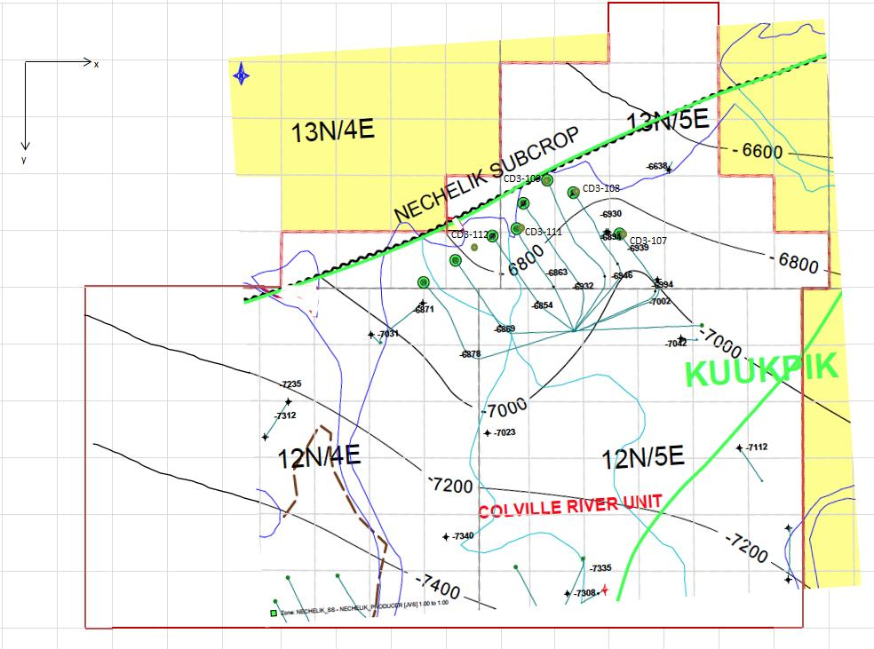
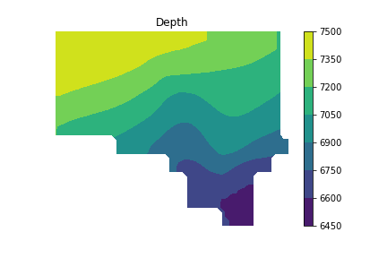

# Project 1

Given the following topographical map

Implement the Python function `extrapolate_depth()` below to interpolate/extrapolate the depth information contained in the topographic map to a grid overlaying the field.  The function should take three arguements, a `filename`, and $N_x$ and $N_y$ cooresponding to the number of grid points to interpolate to in the $x$ and $y$ directions, respectively.  The grid points should be considered the center of blocks that span the entire domain in each direction.  Use the left edge of the field as the $x=0$ datum and the top of the field as the $y=0$ datum.  Each grid on the map spans $523$ ft.

To digitize the topographic map, use the web-based [WebPlotDigitizer](http://arohatgi.info/WebPlotDigitizer/app/?), and refer to the [YouTube tutorial](http://youtu.be/5J-nKIy0bGo) for help.  Please name your data file `'Nechelik_Data.csv'` and add be sure to add it to the repository upon submission.

The function `extrapolate_depth()` should return an array with $N_y$ rows and $N_x$ columns containing the depth values (this is the natural way the SciPy function `griddata()` will return values).  The test checks for the acccuracy of a section of this data away from the boundaries of the field.  The tolerance on the tests is loose enough, such that small errors in digitizing the data will not cause the test to fail.  I have verified this myself with multiple digitizations.

You should use a 2-step interpolate then extrapolate procedure.  First, interpolate the data with `griddata()` using the `method=cubic` option.  This will give you a high-accuracy interpolation, but only inside the [convex hull](https://en.wikipedia.org/wiki/Convex_hull) of the digitized data.  To extend the data to the boundaries of the reservoir use the newly interpolated values as the data in an additional call to `griddata()` this time using the `method=nearest` option.  This will fill in the rest of the domain with constant values according to the value of the nearest data point.  Finally, you should *mask* the final values with `nan` for any ($x,y$) grid point location outside the boundaries of the domain.  This will allow you to easily create a contour plot like this one

Plots may be useful for checking the *sanity* of your results, but it's the actual values that will be tested.  Your final submission and function `extraploate_depth()` should not contain any plot commands.
