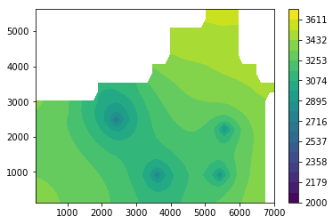

# Project 2

In this project, you will solve a two-dimensional reservoir simulation in a heterogenuous reservoir with multple wells. We will use real data from the Nechelik reservoir that we have looked at several times throughout the semester.

For this project, you should implement the class below `Project2()` which inherits from `TwoDimReservoir` (which inherits from `OneDimReservoir`). 
 
Other than reading the data from a file, you may not need to write any additional code for your simulation to work.  However, it might be a good idea to write a few plotting routines to produce some plots like this one

